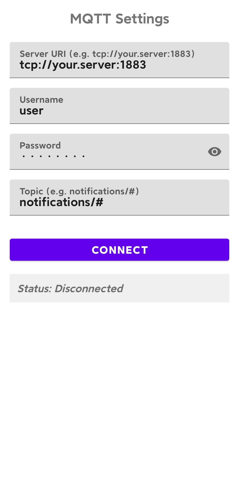

# MQTT Notifier for Android

https://github.com/liboyang0112/smac.git

A lightweight foreground service-based Android app that listens to MQTT messages and shows instant notifications. Perfect for home automation alerts, IoT monitoring, or remote logging and debugging.

Built with Kotlin, `MqttAndroidClient`, and foreground services to ensure reliable delivery — even when the app is in the background.

> ✅ Releases are tested on Redmi K50.

---

## 🚀 Features

- 🔔 Real-time MQTT message notifications
- 🔐 Supports username/password authentication
- 📱 Persistent foreground service (won’t die in background)
- 🔊 High-priority notifications with vibration
- 🎯 Auto-reconnects on network loss
- 🧩 Clean Kotlin + Coroutines architecture
- 💡 Toggles connect/disconnect from UI
- 🔄 Survives app restarts (`START_STICKY`)

---

## 📷 How It Works

1. App connects to your MQTT broker (e.g., Mosquitto, EMQX, HiveMQ).
2. Subscribes to a topic like `notifications/warning`.
3. When a message arrives, it shows a high-priority notification.
4. Runs in foreground with persistent notification to avoid being killed.

---

## 📄 License & Ownership

This project is © 2025 Boyang.  
All rights reserved except as granted under the [Mozilla Public License 2.0 (MPL-2.0)](LICENSE).

- ✅ You are free to use, modify, and distribute this app.
- 🔒 Modifications to original files must remain open under MPL-2.0.
- 🚫 Do not repackage and sell this app as your own product.
- 🙏 Please credit the original author if used in public projects.
